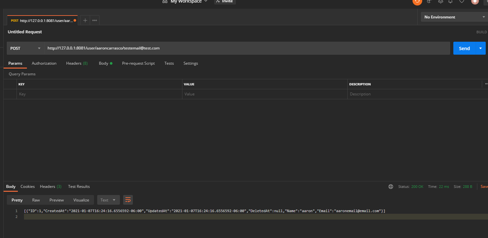
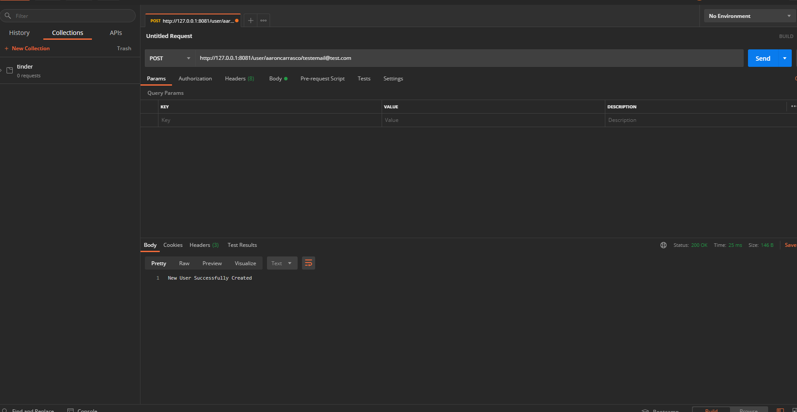
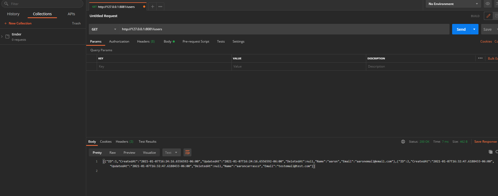
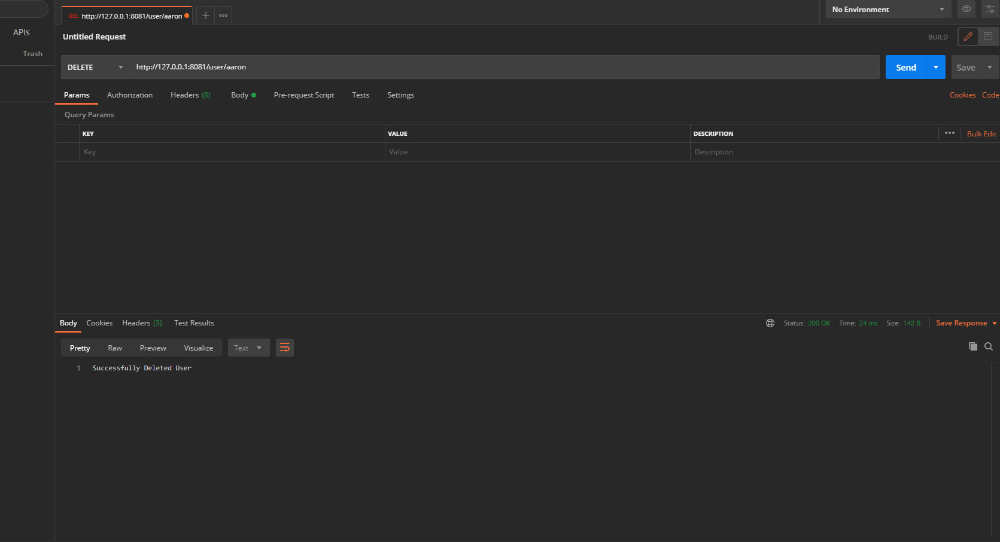

# basic-golang-api
posting a new user to create new user endpoint 

response after successfully creating a new user 

making a call to get all users in database 

choosing a user to delete from database 

response after sucessfully deleting a user from database 

